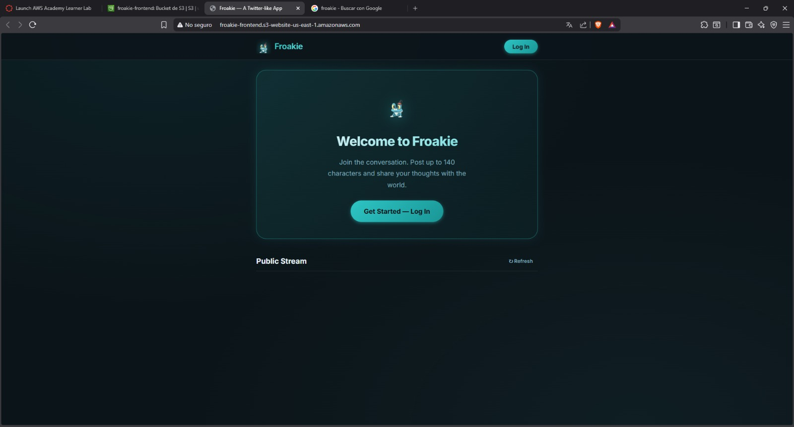
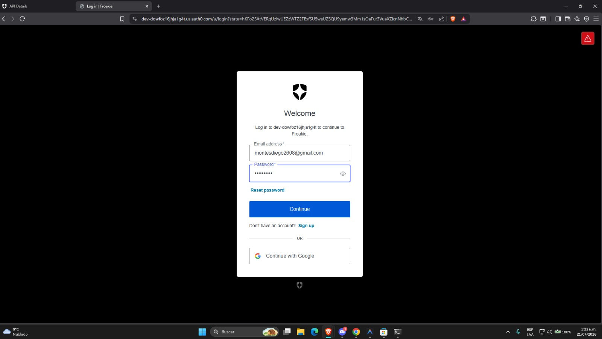
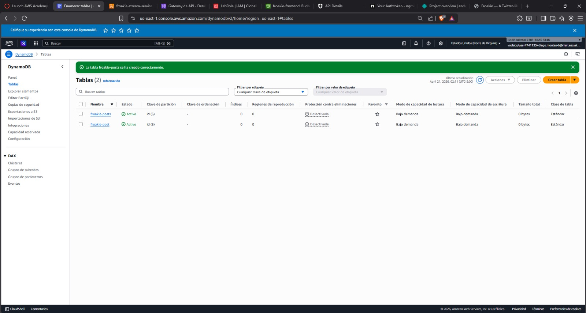
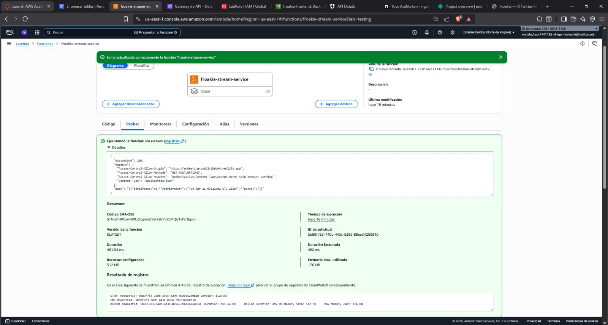
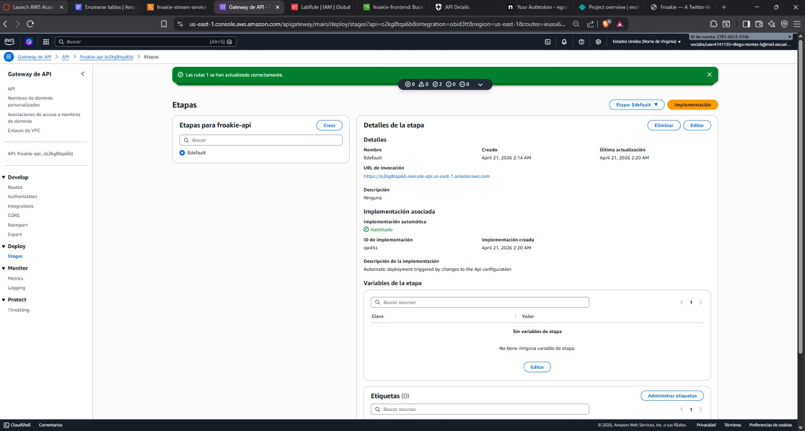
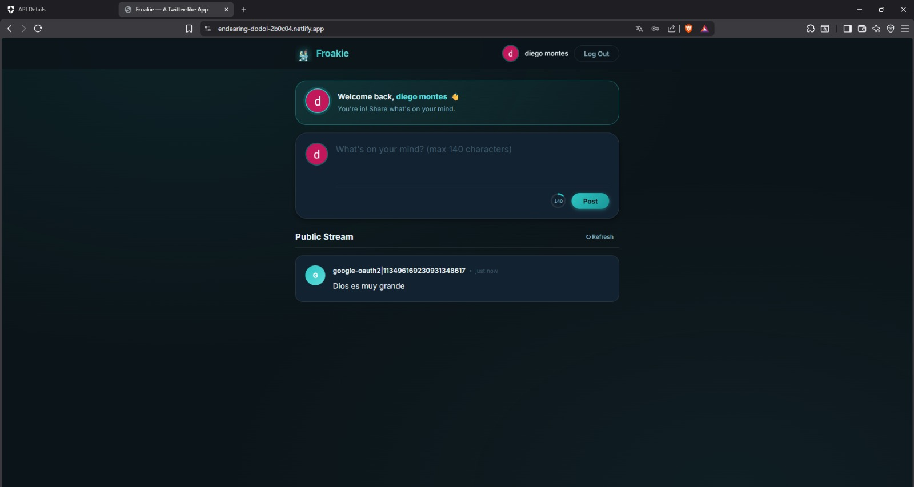

# 🐸 Froakie — Twitter-like App

> Aplicación web inspirada en Twitter con autenticación Auth0, backend Spring Boot, microservicios en AWS Lambda y frontend en Netlify.

## Tabla de Contenidos

- [Descripción del Proyecto](#descripción-del-proyecto)
- [Arquitectura Final](#arquitectura-final)
- [Stack Tecnológico](#stack-tecnológico)
- [Configuración Local y Auth0](#configuración-de-auth0)
- [Despliegue en AWS](#despliegue-en-aws)
- [Endpoints de la API](#endpoints-de-la-api)
- [Reporte de Pruebas](#reporte-de-pruebas)
- [Links del Proyecto](#links-del-proyecto)
- [Evidencias](#evidencias)
---

## Descripción del Proyecto

**Froakie** es una aplicación web simplificada inspirada en Twitter. Permite a usuarios autenticados publicar mensajes de hasta 140 caracteres y ver un feed público global con todos los posts.

### Funcionalidades principales:
- Registro e inicio de sesión mediante **Auth0** (OAuth2 + PKCE)
- Publicar mensajes de hasta **140 caracteres**
- Ver el **feed público** con todos los posts en tiempo real
- Consultar el **perfil del usuario autenticado** (`/api/me`)
- Polling automático del stream cada 15 segundos

---

## Arquitectura Final

El proyecto evolucionó de un monolito Spring Boot a microservicios serverless en AWS:

```
┌─────────────────────────────────────────────────────────────────┐
│                        CLIENTE (Browser)                        │
│              https://endearing-dodol-2b0c04.netlify.app         │
│                    HTML + CSS + Vanilla JS                      │
└──────────────────────┬──────────────────────────────────────────┘
                       │
                       │ HTTPS
                       ▼
┌─────────────────────────────────────────────────────────────────┐
│                         AUTH0                                   │
│              dev-dowfoz16jhja1g4t.us.auth0.com                  │
│         OAuth2 Authorization Code Flow + PKCE                   │
│              Emite JWT Access Tokens (RS256)                    │
└──────────────────────┬──────────────────────────────────────────┘
                       │ JWT Bearer Token
                       ▼
┌─────────────────────────────────────────────────────────────────┐
│                     AWS API GATEWAY                             │
│       https://o4vxlq7lqd.execute-api.us-east-1.amazonaws.com   │
│                    HTTP API (us-east-1)                         │
│                                                                 │
│  GET  /api/stream  ──►  froakie-stream-service (Lambda)        │
│  GET  /api/posts   ──►  froakie-post-service   (Lambda)        │
│  POST /api/posts   ──►  froakie-post-service   (Lambda)        │
│  GET  /api/me      ──►  froakie-user-service   (Lambda)        │
└───────────┬──────────────────────────────────────────────────── ┘
            │
            ▼
┌───────────────────────────────────────────────┐
│              AWS LAMBDA (Java 21)             │
│                                               │
│  ┌─────────────────────────────────────────┐  │
│  │  froakie-stream-service                 │  │
│  │  StreamHandler::handleRequest           │  │
│  │  → GET /api/stream                      │  │
│  └─────────────────────────────────────────┘  │
│                                               │
│  ┌─────────────────────────────────────────┐  │
│  │  froakie-post-service                   │  │
│  │  PostHandler::handleRequest             │  │
│  │  → GET /api/posts                       │  │
│  │  → POST /api/posts (JWT requerido)      │  │
│  └─────────────────────────────────────────┘  │
│                                               │
│  ┌─────────────────────────────────────────┐  │
│  │  froakie-user-service                   │  │
│  │  UserHandler::handleRequest             │  │
│  │  → GET /api/me (JWT requerido)          │  │
│  └─────────────────────────────────────────┘  │
└──────────────────────┬────────────────────────┘
                       │
                       ▼
┌─────────────────────────────────────────────────────────────────┐
│                      AWS DynamoDB                               │
│                   Tabla: froakie-posts                          │
│              Partition Key: id (String)                         │
│         Campos: id, content, authorId, authorName, createdAt    │
└─────────────────────────────────────────────────────────────────┘
```

### Evolución: Monolito → Microservicios

| Fase | Descripción |
|------|-------------|
| **Fase 1** | Monolito Spring Boot con H2 en memoria, Swagger UI, Auth0 como Resource Server |
| **Fase 2** | Frontend estático en Netlify con Auth0 SPA SDK |
| **Fase 3** | Refactorización a 3 microservicios AWS Lambda + DynamoDB + API Gateway |

---

## Stack Tecnológico

| Capa | Tecnología | Versión |
|------|-----------|---------|
| Backend monolito | Spring Boot | 3.2.5 |
| Lenguaje backend | Java | 21 (LTS) |
| Seguridad monolito | Spring Security + OAuth2 Resource Server | 6.x |
| Base de datos monolito | H2 In-Memory | Runtime |
| ORM | Spring Data JPA + Hibernate | 6.4 |
| Documentación API | Springdoc OpenAPI | 2.5.0 |
| Microservicios | AWS Lambda | Java 21 |
| Base de datos producción | AWS DynamoDB | - |
| API pública | AWS API Gateway (HTTP API) | - |
| Frontend | HTML5 + Vanilla JS + CSS3 | ES2022 |
| Hosting frontend | Netlify | - |
| Autenticación | Auth0 SPA JS SDK | v2 (CDN) |
| Identity Provider | Auth0 | - |
| Tests | JUnit 5 + MockMvc + Spring Security Test | - |

---


### URLs locales
| Servicio | URL |
|---------|-----|
| Frontend | http://localhost:3000 |
| Backend | http://localhost:8080 |
| Swagger UI | http://localhost:8080/swagger-ui/index.html |
| OpenAPI JSON | http://localhost:8080/v3/api-docs |
| H2 Console | http://localhost:8080/h2-console |

---

## Configuración de Auth0

### 1. Crear cuenta en Auth0
- En [manage.auth0.com](https://manage.auth0.com)
- Crea un tenant (ej: `dev-xxxx.us.auth0.com`)

### 2. Crear la aplicación SPA
1. **Applications → Applications → Create Application**
2. Nombre: `Froakie`
3. Tipo: **Single Page Application**
4. En **Settings**, configura:

**Allowed Callback URLs:**
```
http://localhost:3000, https://TU_SITIO.netlify.app
```

**Allowed Logout URLs:**
```
http://localhost:3000, https://TU_SITIO.netlify.app
```

**Allowed Web Origins:**
```
http://localhost:3000, https://TU_SITIO.netlify.app
```

5. En **Advanced Settings → Grant Types**, activa:
   - Authorization Code
   - Refresh Token

### 3. Crear la API en Auth0
1. **Applications → APIs → Create API**
2. Nombre: `Froakie API`
3. Identifier: `https://twitter-app-api`
4. Algorithm: `RS256`
5. Activa **"Allow Offline Access"**

### 4. Autorizar la app SPA a usar la API
1. **Applications → APIs → Froakie API → Application Access**
2. Busca tu app **Froakie** y cambia User Access a **Authorized**

---

## Despliegue del Frontend en Netlify

### Prueba 1: Drag & Drop
1. En [netlify.com](https://netlify.com) y se crea una cuenta
2. En el dashboard, se arrastra la carpeta `frontend/` completa
3. Netlify genera una URL tipo `https://xxxx.netlify.app`

### Prueba 2: Amazon S3
1. Crear bucket S3 con nombre único
2. Habilitar **Static Website Hosting** en Properties
3. Desactivar **Block Public Access**
4. Agregar Bucket Policy:
```json
{
  "Version": "2012-10-17",
  "Statement": [{
    "Sid": "PublicReadGetObject",
    "Effect": "Allow",
    "Principal": "*",
    "Action": "s3:GetObject",
    "Resource": "arn:aws:s3:::NOMBRE-BUCKET/*"
  }]
}
```
5. Subir los 3 archivos del frontend

---

## Despliegue en AWS

### Prerrequisitos AWS
- Cuenta de AWS
- Región: `us-east-1` (Norte de Virginia)

### Paso 1: Crear tabla DynamoDB
1. **AWS Console → DynamoDB → Create table**
2. **Table name:** `froakie-posts`
3. **Partition key:** `id` (String)
4. Configuración por defecto → **Create table**

### Paso 2: Compilar el JAR de Lambda
```bash
cd froakie-lambdas
mvn package -DskipTests
```
El JAR generado estará en `target/froakie-lambdas-1.0.jar`

### Paso 3: Crear las 3 funciones Lambda

Para cada función:
1. **AWS Console → Lambda → Create function**
2. **Author from scratch**
3. **Runtime:** Java 21
4. **Architecture:** x86_64

| Función | Handler |
|---------|---------|
| `froakie-stream-service` | `com.froakie.StreamHandler::handleRequest` |
| `froakie-post-service` | `com.froakie.PostHandler::handleRequest` |
| `froakie-user-service` | `com.froakie.UserHandler::handleRequest` |

Para cada función:
- Subir el JAR: **Upload from → .zip or .jar file**
- Configurar el handler correcto en **Runtime settings**

### Paso 4: Crear el API Gateway
1. **AWS Console → API Gateway → Create API**
2. Seleccionar **HTTP API → Build**
3. Nombre: `froakie-api`
4. Crear las siguientes rutas:

| Método | Ruta | Lambda |
|--------|------|--------|
| GET | `/api/stream` | `froakie-stream-service` |
| GET | `/api/posts` | `froakie-post-service` |
| POST | `/api/posts` | `froakie-post-service` |
| GET | `/api/me` | `froakie-user-service` |
| OPTIONS | `/{proxy+}` | `froakie-stream-service` |

5. En cada integración, cambiar **Payload format version** a `1.0`

### Paso 5: Configurar CORS en API Gateway
1. **API Gateway → froakie-api → CORS → Configurar**
2. **Allow Origin:** `https://TU_SITIO.netlify.app`
3. **Allow Headers:** `Authorization,Content-Type,Accept,ngrok-skip-browser-warning`
4. **Allow Methods:** `GET,POST,OPTIONS`

### Paso 6: Desplegar el API Gateway
1. **Deploy → Stages → $default**
2. La URL pública será algo como:
   ```
   https://xxxxxxxxxx.execute-api.us-east-1.amazonaws.com
   ```

### Paso 7: Actualizar el frontend con la URL de API Gateway
En `frontend/app.js`:
```javascript
apiBaseUrl: 'https://xxxxxxxxxx.execute-api.us-east-1.amazonaws.com',
```
Volver a subir el archivo a Netlify.

---

## Microservicios AWS Lambda

### StreamHandler
- **Ruta:** `GET /api/stream`
- **Auth:** Pública (no requiere JWT)
- **Función:** Escanea toda la tabla DynamoDB `froakie-posts`, ordena los posts por `createdAt` descendente y devuelve un objeto con `posts`, `totalPosts` y `retrievedAt`.

### PostHandler
- **Ruta GET:** `GET /api/posts` — Pública, lista todos los posts
- **Ruta POST:** `POST /api/posts` — Requiere JWT Bearer token
- **Función POST:** Valida el JWT manualmente decodificando el payload Base64, extrae `sub`, `name` y `nickname`, guarda el post en DynamoDB con un UUID generado y timestamp ISO 8601.

### UserHandler
- **Ruta:** `GET /api/me`
- **Auth:** Requiere JWT Bearer token
- **Función:** Decodifica el JWT del header `Authorization`, extrae los claims `sub`, `name`, `email` y `picture`, y los devuelve como JSON.
---

## Endpoints de la API

### Monolito Spring Boot (localhost:8080)

| Método | Ruta | Auth | Descripción |
|--------|------|------|-------------|
| `GET` | `/api/posts` | ❌ Público | Lista todos los posts |
| `POST` | `/api/posts` | ✅ JWT | Crea un nuevo post (máx. 140 chars) |
| `GET` | `/api/stream` | ❌ Público | Feed global con metadatos |
| `GET` | `/api/me` | ✅ JWT | Info del usuario autenticado |
| `GET` | `/api/me/posts` | ✅ JWT | Posts del usuario actual |
| `POST` | `/api/dev/token` | ❌ Solo perfil dev | Genera JWT local para testing |

### Microservicios Lambda (API Gateway)

| Método | Ruta | Auth | Lambda |
|--------|------|------|--------|
| `GET` | `/api/stream` | ❌ Público | froakie-stream-service |
| `GET` | `/api/posts` | ❌ Público | froakie-post-service |
| `POST` | `/api/posts` | ✅ JWT | froakie-post-service |
| `GET` | `/api/me` | ✅ JWT | froakie-user-service |

---

## Explicación del Código

### Backend — Spring Boot Monolith

#### SecurityConfig.java
Configura el backend como **OAuth2 Resource Server**. En lugar de generar tokens, los valida usando las claves públicas de Auth0 (JWKS endpoint). Incluye `AudienceValidator` para verificar que el token sea específicamente para esta API.

```java
.oauth2ResourceServer(oauth2 ->
    oauth2.jwt(jwt -> jwt.decoder(jwtDecoder())));
```

#### DevSecurityConfig.java
Activo solo con el perfil `dev`. Usa un JWT decoder HMAC-SHA256 local para permitir desarrollo sin conexión a Auth0. Expone `POST /api/dev/token` para generar tokens de prueba.

#### PostController.java
En `POST /api/posts`, extrae la identidad del usuario del JWT inyectado por Spring Security:
```java
String authorId = jwt.getSubject();
String authorName = jwt.getClaimAsString("name");
```

#### Frontend — app.js

El flujo de autenticación usa **Authorization Code Flow con PKCE**:
1. `loginWithRedirect()` → redirige a Auth0
2. Auth0 devuelve `code` en la URL
3. `handleRedirectCallback()` intercambia el código por un JWT
4. `getTokenSilently()` obtiene el token para cada request al backend

#### Lambda — PostHandler.java

Decodifica el JWT manualmente para obtener el autor:
```java
String[] parts = token.split("\\.");
String payloadJson = new String(Base64.getUrlDecoder().decode(parts[1]));
JsonNode payload = mapper.readTree(payloadJson);
String authorId = payload.get("sub").asText();
```

---

## Reporte de Pruebas

### Tests del Monolito (JUnit 5 + MockMvc)

| # | Test | Resultado |
|---|------|------|
| 1 | `givenNoAuth_whenGetPosts_thenReturn200` | PASS |
| 2 | `givenNoAuth_whenGetStream_thenReturn200` | PASS |
| 3 | `givenNoAuth_whenPostPost_thenReturn401` | PASS |
| 4 | `givenNoAuth_whenGetMe_thenReturn401` | PASS |
| 5 | `givenValidJwt_whenPostPost_thenReturn201` | PASS |
| 6 | `givenValidJwt_whenGetMe_thenReturn200` | PASS |
| 7 | `givenValidJwt_whenPostWithContentOver140Chars_thenReturn400` | PASS |
| 8 | `givenValidJwt_whenPostWithBlankContent_thenReturn400` | PASS |

**Resultado: 8/8 PASSED — BUILD SUCCESS**

### Pruebas Manuales (Frontend + Microservicios)

| Prueba | Resultado |
|--------|-----|
| Login con cuenta Google via Auth0 | OK |
| Crear post desde Netlify → se guarda en DynamoDB | OK |
| Ver stream público desde API Gateway | OK |
| Intentar POST sin JWT → 401 Unauthorized | OK |
| Validación de 140 caracteres en frontend | OK |
| Polling automático del stream cada 15s | OK |
| Logout limpia sesión correctamente | OK |

---

## Links del Proyecto

| Recurso            | URL |
|--------------------|-----|
| Frontend (Netlify) | https://endearing-dodol-2b0c04.netlify.app |
| API Gateway        | https://o4vxlq7lqd.execute-api.us-east-1.amazonaws.com |
| Stream público     | https://o4vxlq7lqd.execute-api.us-east-1.amazonaws.com/api/stream |
| Swagger UI (local) | http://localhost:8080/swagger-ui/index.html |
| Video demostrativo | https://drive.google.com/file/d/1F9RZGtYS9Q7P3-Ga4gdg_mcG0A8M05R2/view?usp=sharing |

---

## Evidencias












